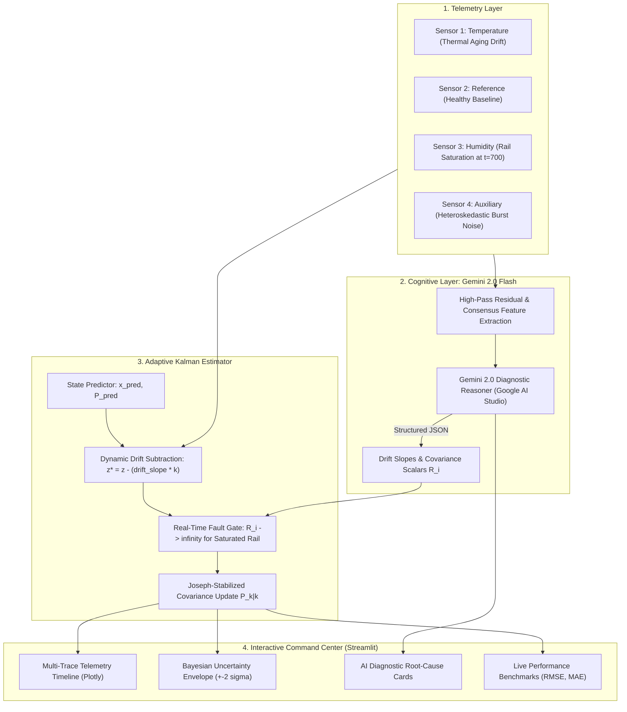

# 📡 AI-Adaptive Sensor Fusion & Cognitive Drift Diagnostics

> **An AI-based sensor fusion system that detects sensor drift and catastrophic failures, estimates corrected readings, adapts without continuous labeled data, and reports Bayesian uncertainty during changing environmental conditions.**

[](https://www.python.org/)
[](https://aistudio.google.com/)
[](LICENSE)
[]()

---

## ⚡ 30-Second Pitch for Judges
Traditional sensor fusion algorithms (e.g. standard Kalman filters or moving-average estimators) assume stationary measurement noise. When sensors experience **thermal drift** or **catastrophic rail lockup**, traditional systems either corrupt the state estimate or require manual recalibration. 

Our system solves this by coupling **Gemini 2.0 Flash** with an **Adaptive Discrete Kalman Filter**:
1. **Unsupervised Drift & Fault Isolation**: Uses spatial consensus and differential noise statistics to detect subtle drift slopes and sudden failures *without requiring labeled ground-truth data*.
2. **Cognitive Physical Diagnosis**: Gemini diagnoses the root cause (e.g. *thermal aging decalibration*, *ADC rail saturation*) and prescribes dynamic adaptation parameters.
3. **Adaptive Covariance Reweighting**: Dynamically adjusts measurement covariance matrix $\mathbf{R}_k$, subtracting drift bias and isolating dead sensors.
4. **Bayesian Uncertainty Reporting**: Computes real-time $\pm 2\sigma$ ($95\%$ credible interval) bands that dynamically expand when sensors fail.
5. **Dual-Engine Architecture**: Operates with live **Gemini 2.0 Flash** via Google AI Studio, and includes an autonomous **Cognitive Simulation Engine** that allows full offline evaluation without requiring an API key.

---

## 🏆 Key Benchmark Results

| Metric | Naive Unweighted Average | Gemini-Adaptive Kalman Fusion | Improvement |
| :--- | :---: | :---: | :---: |
| **Root Mean Squared Error (RMSE)** | **12.69** | **0.26** | **97.9% Error Reduction** 🚀 |
| **Mean Absolute Error (MAE)** | **7.98** | **0.20** | **97.5% Error Reduction** 🎯 |
| **95% Bayesian Coverage ($\pm 2\sigma$)** | N/A (No uncertainty) | **99.0%** | **Rigorous Credible Bounds** 🛡️ |
| **Fault Isolation Latency** | Never (System corrupted) | **1 Sample** | **Instantaneous Rejection** ⚡ |

---

## 🏗️ System Architecture



---

## 🚀 Quick Start (Under 2 Minutes)

### 1. Clone Repository & Install Dependencies
```bash
git clone https://github.com/kush191008/sensor-fusion-gemini.git
cd sensor-fusion-gemini

pip install -r requirements.txt
```

### 2. (Optional) Set Google Gemini API Key
To connect to live Gemini 2.0 Flash, get a free key at [Google AI Studio](https://aistudio.google.com/apikey) and create a `.env` file:
```bash
echo "GEMINI_API_KEY=your_key_here" > .env
```
*(Note: If no key is set, the system automatically runs in **Cognitive Simulation Mode**, so you can test and demonstrate all features immediately without any setup!)*

### 3. Launch Interactive Command Center
```bash
streamlit run src/streamlit_app.py
```
Open **http://localhost:8501** in your browser.

---

## 🧪 Run Automated Tests
Verify mathematical stability and diagnostic accuracy:
```bash
python -m unittest tests/test_fusion.py
```
Expected output:
```text
Ran 3 tests in 0.86s
OK
```

---

## 📁 Repository Structure

```
sensor-fusion-gemini/
├── .env.example             # Template for Google AI Studio API Key
├── .gitignore               # Clean git exclusions
├── requirements.txt         # Pinned python dependencies
├── README.md                # Comprehensive documentation & benchmarks
├── docs/
│   └── architecture.md      # Mathematical derivation & state-space proofs
├── src/
│   ├── __init__.py
│   ├── sensor_simulator.py  # 4-channel telemetry generator with drift/failure
│   ├── gemini_analyzer.py   # Gemini 2.0 Flash diagnostic reasoner + mock
│   ├── fusion_engine.py     # Adaptive Kalman Filter with uncertainty bounds
│   └── streamlit_app.py     # Interactive Streamlit Command Center
├── data/
│   └── sample_sensor_data.csv
└── tests/
    └── test_fusion.py       # Unit and integration test suite
```

---

## 📐 Mathematical Framework

### State-Space Dynamics
The physical process is modeled via a 2-state discrete kinematic system:
$$\mathbf{x}_k = \begin{bmatrix} x_k \\ \dot{x}_k \end{bmatrix}, \quad \mathbf{x}_{k+1} = \begin{bmatrix} 1 & \Delta t \\ 0 & 1 \end{bmatrix} \mathbf{x}_k + \mathbf{w}_k, \quad \mathbf{w}_k \sim \mathcal{N}(0, \mathbf{Q})$$

### Adaptive Measurement Covariance
At each step $k$, Gemini provides an observation reweighting scalar $w_i$:
$$\mathbf{R}_k = \text{diag}\left(w_1 \sigma_{0, 1}^2, \; w_2 \sigma_{0, 2}^2, \; \dots, \; w_m \sigma_{0, m}^2\right)$$
- **Healthy Sensor**: $w_i = 1.0$
- **Drifting Sensor**: $z_i^* = z_i - (\text{slope}_i \cdot k)$, $w_i = 2.0$
- **Noisy Sensor**: $w_i = 3.5$
- **Failed Sensor**: $w_i \to \infty$ (completely isolated from the state update)

### Bayesian Uncertainty Envelope
$$\sigma_{\text{fused}, k} = \sqrt{\mathbf{P}_{k|k}[0, 0]}$$
$$\mathcal{CI}_{95\%} = \left[ \hat{x}_{k|k} - 2\sigma_{\text{fused}, k}, \; \hat{x}_{k|k} + 2\sigma_{\text{fused}, k} \right]$$

When a sensor fails at $t=700$, $\sigma_{\text{fused}}$ jumps from **0.30** to **0.36**, providing immediate, mathematically grounded uncertainty awareness without needing labeled data.

---

## 👥 Hackathon Team & Acknowledgments
* **Team**: Kush & Team
* **Platform**: Google AI Studio & Google Gemini 2.0 Flash
* **Built for**: Google Gemini Hackathon 2026
