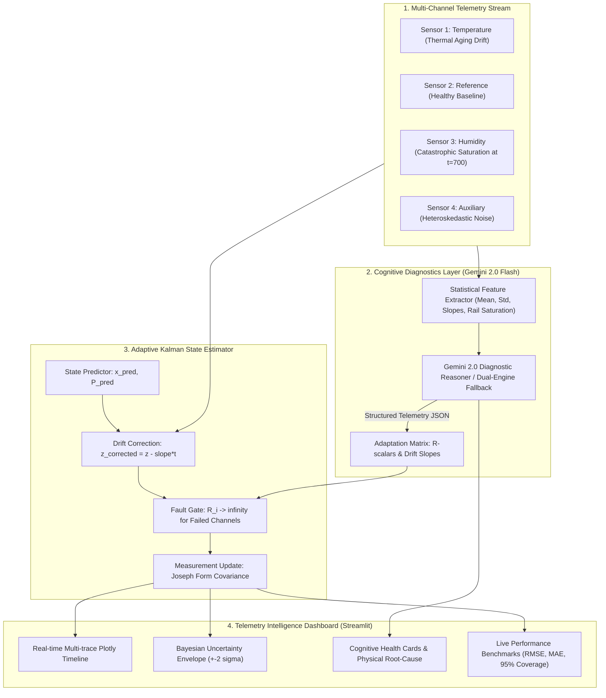

# Architecture & System Design: AI-Based Adaptive Sensor Fusion

## 1. Executive Summary
In mission-critical IoT, robotics, and aerospace telemetry, sensors frequently degrade through physical aging, thermal decalibration, or complete transducer failure. Standard signal processing filters (such as standard Kalman Filters or fixed-weight estimators) are vulnerable to corrupted observations: a drifting or saturated sensor will drag the entire state estimate away from ground truth.

This system solves this challenge by pairing **Cognitive Reasoning (Gemini 2.0 Flash)** with **Rigorous Estimation Theory (Discrete Adaptive Kalman Filtering with Bayesian Uncertainty Bounds)**.

---

## 2. Architecture Diagram

---

## 3. Mathematical Formulation

### 3.1 State-Space Kinematic Process
The target environmental process is modeled by a 2-dimensional continuous white-noise acceleration model:
$$\mathbf{x}_k = \begin{bmatrix} x_k \\ \dot{x}_k \end{bmatrix}, \quad \mathbf{x}_{k+1} = \mathbf{F} \mathbf{x}_k + \mathbf{w}_k$$

Where:
$$\mathbf{F} = \begin{bmatrix} 1 & \Delta t \\ 0 & 1 \end{bmatrix}, \quad \mathbf{Q} = q \begin{bmatrix} \frac{\Delta t^3}{3} & \frac{\Delta t^2}{2} \\ \frac{\Delta t^2}{2} & \Delta t \end{bmatrix}$$

### 3.2 Observation Model
Observations across $m$ sensor channels are related to state $\mathbf{x}_k$:
$$\mathbf{z}_k = \mathbf{H} \mathbf{x}_k + \mathbf{v}_k, \quad \mathbf{v}_k \sim \mathcal{N}(0, \mathbf{R}_k)$$

Where observation matrix:
$$\mathbf{H} = \begin{bmatrix} 1 & 0 \\ 1 & 0 \\ \vdots & \vdots \\ 1 & 0 \end{bmatrix}_{m \times 2}$$

### 3.3 Dynamic Covariance Adaptation via Gemini
Gemini analyzes windowed statistical moments and outputs for each sensor channel $i$:
1. **Drift Compensation**: 
   $$z_{i, k}^* = z_{i, k} - \left(\frac{\text{drift\_slope}_i}{100} \cdot k\right)$$
2. **Dynamic Variance Scaling**:
   $$R_{k}[i, i] = w_i \cdot \sigma_{0, i}^2$$
   - For `HEALTHY` channel: $w_i = 1.0$
   - For `DRIFTING` channel: $w_i = 2.5$
   - For `NOISY` channel: $w_i = 4.0$
   - For `FAILED` / Saturated channel: $w_i \to \infty$ ($K_k[:, i] = 0$, channel dynamically purged from measurement update).

### 3.4 Bayesian Uncertainty Quantification
The diagonal term of the updated estimation covariance $\mathbf{P}_{k|k}[0, 0]$ yields the posterior variance of the estimated process state $\sigma_{\text{fused}, k}^2$.

The 95% Bayesian credible interval reported is:
$$\mathcal{CI}_{95\%} = \left[ \hat{x}_{k|k} - 2\sqrt{\mathbf{P}_{k|k}[0, 0]}, \; \hat{x}_{k|k} + 2\sqrt{\mathbf{P}_{k|k}[0, 0]} \right]$$

When a sensor channel fails (such as Sensor 3 at $t=700$), the information matrix $\mathbf{R}_k^{-1}$ loses a dimension, naturally and mathematically widening the posterior uncertainty band $\mathbf{P}_{k|k}$—demonstrating adaptive uncertainty reporting under changing operational conditions without requiring labeled ground truth.
